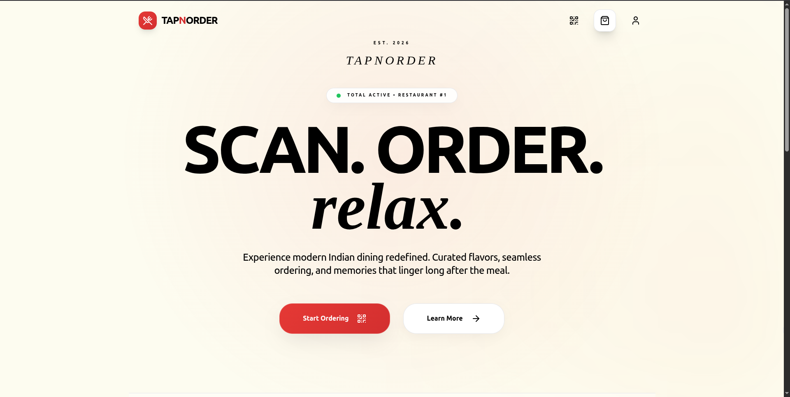
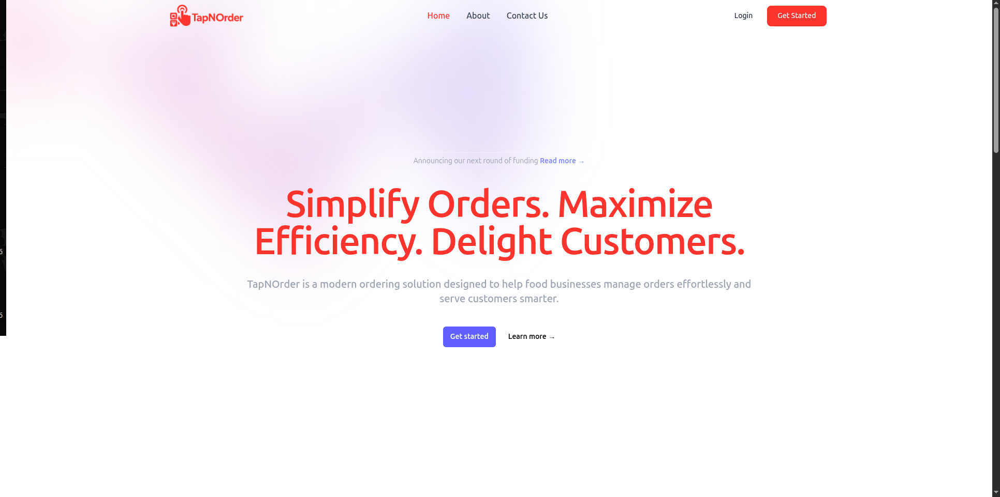
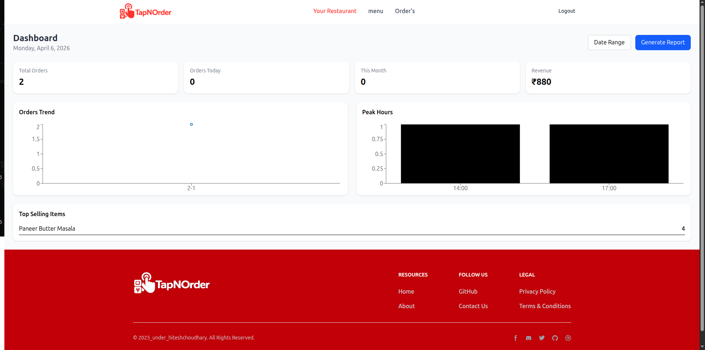
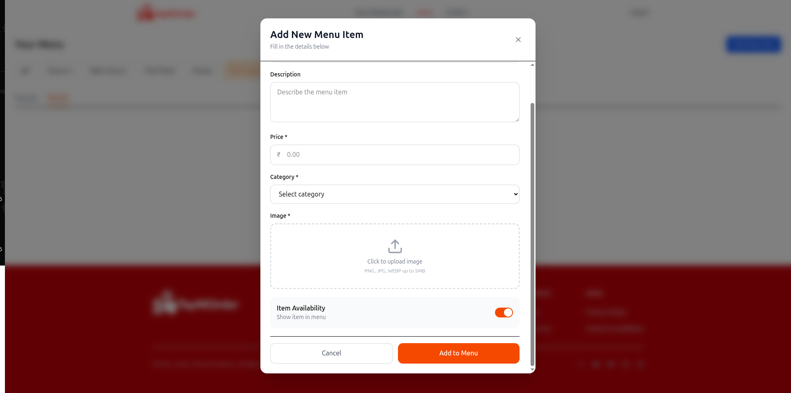
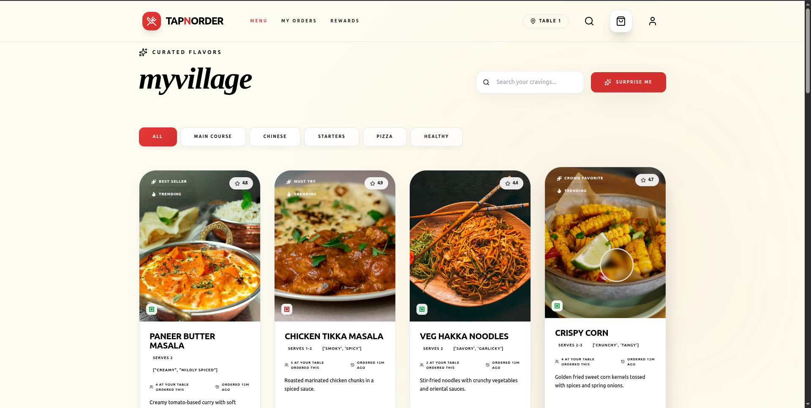
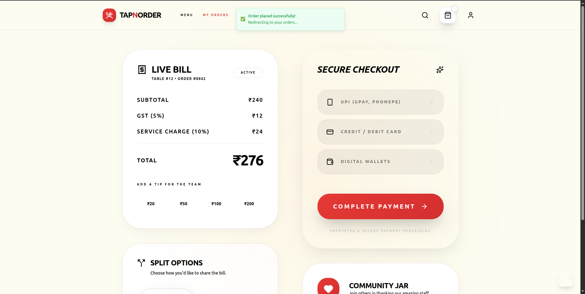

# TapNOrder – Test Case Documentation

## 📌 Project Details

- **Project Name:** TapNOrder  

---

## 📄 Introduction

This document contains the test cases for the TapNOrder system, which allows users to scan QR codes and order food digitally.

---

## 🧪 Test Cases

---

### ✅ TC_01 – Landing Page

| Field | Details |
|------|--------|
| Feature | Landing Page |
| Test Case | Verify homepage loads |
| Steps | Open website URL |
| Expected Result | Homepage displayed |
| Actual Result | Homepage displayed |
| Status | Pass |

📸 **Screenshot:**  

---

### ✅ TC_02 – Login Modal

| Field | Details |
|------|--------|
| Feature | Login |
| Test Case | Verify login modal opens |
| Steps | Click login button |
| Expected Result | Login modal appears |
| Actual Result | Modal appears |
| Status | Pass |

📸 **Screenshot:**  

---

### ✅ TC_03 – Dashboard

| Field | Details |
|------|--------|
| Feature | Dashboard |
| Test Case | Verify dashboard loads |
| Steps | Login → Navigate dashboard |
| Expected Result | Stats and charts visible |
| Actual Result | Data displayed |
| Status | Pass |

📸 **Screenshot:**  

---

### ✅ TC_04 – Add Menu Item

| Field | Details |
|------|--------|
| Feature | Add Dish |
| Test Case | Add new menu item |
| Steps | Fill form → Submit |
| Expected Result | Dish added successfully |
| Actual Result | Dish added |
| Status | Pass |

📸 **Screenshot:**  

---

### ✅ TC_05 – Menu Page

| Field | Details |
|------|--------|
| Feature | Menu |
| Test Case | Display dishes |
| Steps | Open menu page |
| Expected Result | Dishes shown |
| Actual Result | Dishes visible |
| Status | Pass |

📸 **Screenshot:**  

---

### ✅ TC_06 – Billing / Checkout

| Field | Details |
|------|--------|
| Feature | Billing |
| Test Case | Verify bill calculation |
| Steps | Add items → Checkout |
| Expected Result | Correct total |
| Actual Result | Correct |
| Status | Pass |

📸 **Screenshot:**  

---

## 📊 Summary

All major functionalities of TapNOrder were tested successfully.  
The system performs as expected with no critical issues.  
**Order view from restaurant side is remaining.**

---

## ⚠️ Future Testing Scope

- Restaurant order dashboard view  
- Real-time order updates  
- Payment gateway integration  
- Load testing  

---